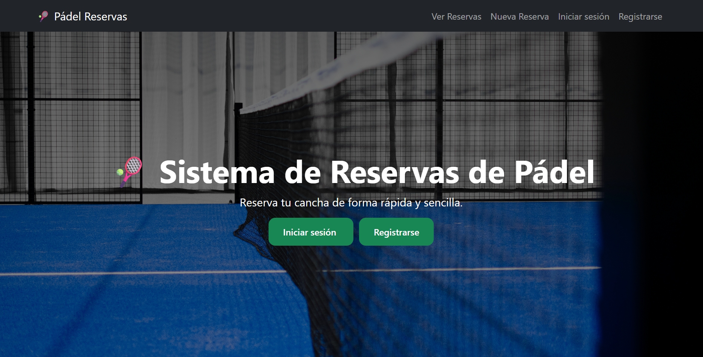
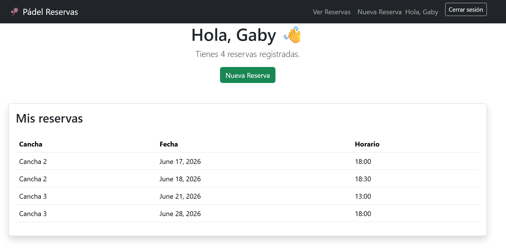
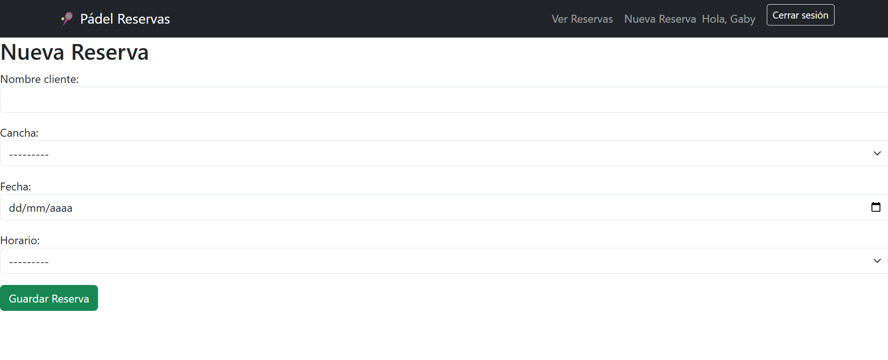

# Sistema de Reservas de Pádel

Aplicación web desarrollada con Django para gestionar reservas de canchas de pádel de forma sencilla y organizada.

## Funcionalidades

- Registro de usuarios
- Inicio y cierre de sesión
- Creación de reservas
- Edición de reservas
- Eliminación de reservas
- Asociación de reservas a usuarios
- Visualización exclusiva de las reservas del usuario autenticado
- Validación para evitar reservas duplicadas
- Panel de administración de Django
- Interfaz responsive con Bootstrap 5

---

## Tecnologías utilizadas

- Python
- Django
- Bootstrap 5
- SQLite
- HTML
- CSS

---

## Capturas de pantalla

### Página de inicio



### Mis reservas




### Nueva reserva



---

## Instalación

Clonar el repositorio:

```bash
git clone https://github.com/GabrielaArrua/Sistema-reservas-padel.git
```

Entrar al proyecto:

```bash
cd Sistema-reservas-padel
```

Crear entorno virtual:

```bash
python -m venv venv
```

Activar entorno virtual:

Windows:

```bash
venv\Scripts\activate
```

Linux / Mac:

```bash
source venv/bin/activate
```

Instalar dependencias:

```bash
pip install -r requirements.txt
```

Aplicar migraciones:

```bash
python manage.py migrate
```

Crear superusuario (opcional):

```bash
python manage.py createsuperuser
```

Ejecutar servidor:

```bash
python manage.py runserver
```

Abrir en el navegador:

```text
http://127.0.0.1:8000/
```

---

## Objetivos del proyecto

Este proyecto fue desarrollado para profundizar conocimientos en:

- Django
- Modelos y migraciones
- Formularios
- Autenticación de usuarios
- CRUD completo
- Bootstrap
- Git y GitHub

---

## Próximas mejoras

- Despliegue en Render
- Horarios dinámicos según disponibilidad
- Perfil de usuario
- Reservas por franjas horarias
- Notificaciones por correo electrónico

---

## Autora

**Gabriela Arrúa**

GitHub:
https://github.com/GabrielaArrua


